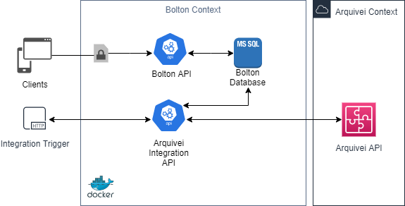
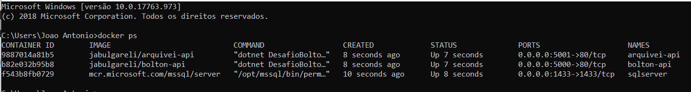

# DesafioBolton
Solução para o desafio proposto pela Arquivei baseado nesse [link](https://public.3.basecamp.com/p/9wuA4g7RB79CBJkjvCzdKNFS).

## Diagrama da proposta

## Descrição do projeto e tecnologias

O projeto foi dividido em duas APIs (Bolton API e Arquivei API), sendo uma para consulta dos valores das notas fiscais e uma que opera como gatilho de execução da integração com a Arquivei. O objetivo dessa separação consiste em possibilitar a execução dos serviços em containers de tamanhos específicos para cada necessidade, por exemplo: A execução da integração tende a consumir mais recursos de máquina do que a consulta de valores. Sendo assim ao rodar uma integração consumindo todo o recurso da API de integraçoes, não teríamos nenhuma perda de performance na API de dados.

Para suportar a manutenção e a extensão do projeto, ele foi projetado utilizando conceitos do DDD/Arq. Hexagonal com objetivo de expor o máximo possível de SOLID no desenvolvimento.

As tecnologias e ferramentas utilizadas foram:
- ASP .NET Core 2.2
- Entity Framework Core
- Flurl
- Docker
- NUnit
- SQL Server
- Swagger

Também foi desenvolvido um controle de estado que guarda a posição da página de resultados da Arquivei para evitar buscar os dados toda execução. Sendo assim, após a primeira execução, o serviço não inicia na primeira página, ele continua da página que parou na última integração com sucesso.

## Como executar

Como já mencionado o projeto utiliza containers Docker, para execução basta realizar o download do arquivo , abrir o bash e navegar até a pasta do docker-compose.yml e executar o comando via bash abaixo:

    docker-compose up

Executar o comando para verificar se os containers estão em execução:

    docker ps

Endereço das APIs (swagger):
- Bolton API: http://localhost:5000
- Arquivei API: http://localhost:5001

Endpoints:
- Endpoint de importação: [http://localhost:5001/api/Integration/nfe](http://localhost:5001/api/Integration/nfe)
- Endpoint de consulta: [http://localhost:5000/api/NFe/(CHAVE DA NFE)/amount](http://localhost:5000/api/NFe/%28CHAVE%20DA%20NFE%29/amount)

Executar integração:

    curl -X POST "http://localhost:5001/api/Integration/nfe"

Consultar uma nota:

    curl -X GET "http://localhost:5000/api/NFe/17171191390526000180550010000282821000324478/amount"

Para encerrar a aplicação, execute o comando abaixo:

    docker-compose down

## Propostas futuras

Melhoria de escalabilidade/controle de custo caso venha a existir segregação de integração para mais de um cliente (muitas notas fiscais), sendo algumas possibilidades:
- Executar a importação das notas via mensageria
- Permitir que o container execute somente quando 

